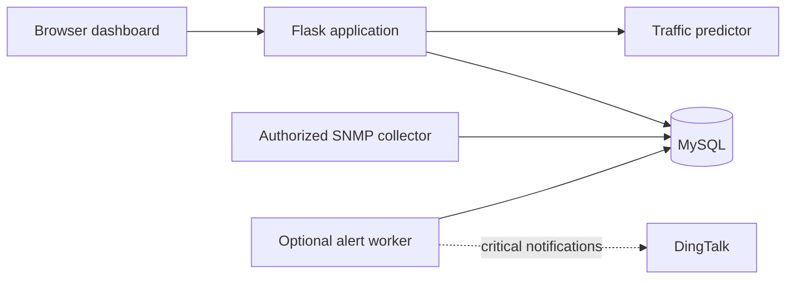

# Campus Network Traffic Monitor

A Flask and MySQL application for authenticated campus-network monitoring,
traffic analysis, short-term forecasting, and alert management.

## Portfolio Snapshot

- **Problem:** help operators observe device-level traffic, investigate trends,
  and manage threshold-based incidents from one web application.
- **Core stack:** Flask, MySQL, ECharts, PySNMP, and scikit-learn.
- **Security upgrades:** environment-based configuration, role checks on every
  protected API, administrator-only device/user operations, and no committed
  credentials.
- **Verification:** 3 lightweight access-control tests pass without requiring a
  running MySQL instance.

## Architecture



## Features

- Role-based authentication: public registration creates normal users only;
  administrator accounts are bootstrapped explicitly.
- Device management with IP validation and activity status.
- Real-time dashboard, history charts, traffic summaries, and device ranking.
- Alert lifecycle: active, acknowledged, and resolved.
- Optional DingTalk notifications for critical alerts.
- SNMP collector for device counter sampling.
- Gradient Boosting traffic forecast with a clearly labelled fallback when the
  database does not contain enough historical data.

## Tech Stack

- Python, Flask, Jinja templates, jQuery, ECharts
- MySQL 8
- PyMySQL and PySNMP
- scikit-learn, NumPy, pandas

## Quick Start

1. Copy `.env.example` to `.env` and replace every placeholder, especially
   `FLASK_SECRET_KEY` and `DB_PASSWORD`.
2. Start a local database:

   ```powershell
   docker compose up -d db
   ```

   Or create a MySQL database manually and run
   `database/schema.sql`.
3. Install dependencies:

   ```powershell
   python -m pip install -r requirements.txt
   ```

4. Create the first administrator:

   ```powershell
   python scripts\bootstrap_admin.py
   ```

5. Start the web application:

   ```powershell
   python app.py
   ```

   Then open `http://127.0.0.1:5000`.

## Optional Data Collection

`real_collector.py` reads SNMP counters for devices that have an SNMP
community configured. Only use it against equipment you own or are explicitly
authorized to monitor.

`utils/traffic_collector.py` creates demo data for interface demonstrations.
It is not a replacement for production telemetry.

## Engineering Decisions

- Credentials, webhook tokens, and Flask keys are read from `.env`, never from
  committed source files.
- Registration always creates a normal user; the first administrator is created
  through a separate bootstrap script.
- The protocol chart aggregates stored TCP connection and UDP flow counts. It
  does not use fabricated random percentages.
- The prediction service loads lazily and reports whether a persisted model or
  a deterministic fallback is being used.
- Alert creation deduplicates active alerts within a time window so one noisy
  device does not create an unlimited stream of identical incidents.

## Verification

```powershell
python -m pytest tests
python -m py_compile app.py predictor.py real_collector.py config.py
```

## Repository Hygiene

The repository deliberately excludes `.env`, model binaries, local SNMP
fixtures, IDE state, thesis artifacts, and any database export. See
`docs/PROJECT_OVERVIEW.md` for the architecture and the meaningful engineering
decisions behind the project.
